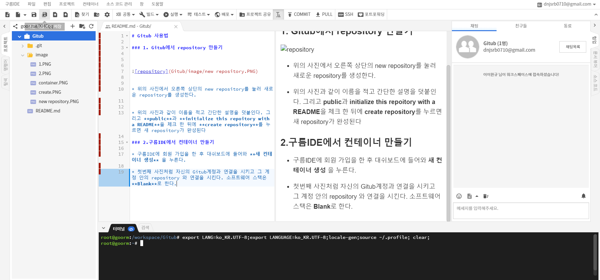

# Gitub 사용법

### 1. Gitub에서 repository 만들기


 


* 위의 사진에서 오른쪽 상단의 new repository를 눌러 새로운 repository를 생성한다.


* 위의 사진과 같이 이름을 적고 간단한 설명을 덧붙인다. 그리고 **public**과 **initialize this repoitory with a README**을 체크 한 뒤에 **create repository**를 누르면 새 repository가 완성된다

### 2.구름IDE에서 컨테이너 만들기


* 구름IDE에 회원 가입을 한 후 대쉬보드에 들어와 **새 컨테이너 생성** 을 누른다.


* 첫번째 사진처럼 자신의 Gitub계정과 연결을 시키고 그 계정 안의 repository 와 연결을 시킨다. 소프트웨어 스택은 **Blank**로 한다.


### 3. 구름IDE에서 작업하고 Gitub으로 올리기

* 컨테이너 와 저장소가 만들어졌으므로 이제는 앞서 배운 마크다운 문법에 맞추어 글을 작성한다.



* 글을 다 작성하였다면 repository로 보내기 위해서 3 가지의 과정을 거쳐야합니다. add, commit, push

* 변경된 파일은 아래 명령어로 (인덱스에) 추가할 수 있어요.
```git add .```
이것이 바로 git의 기본 작업 흐름에서 첫 단계에 해당돼요.

* 하지만 실제로 변경 내용을 확정하려면 아래 명령을 내려야 한답니다.
```git commit -m "이번 확정본에 대한 설명"```
자, 이제 변경된 파일이 HEAD에 반영됐어요.
하지만, 원격 저장소에는 아직 반영이 안 됐답니다.

* 변경 내용 발행(push)하기
현재의 변경 내용은 아직 로컬 저장소의 HEAD 안에 머물고 있어요.
이제 이 변경 내용을 원격 서버로 올려봅시다. 아래 명령을 실행하세요.
```git push origin master```
(다른 가지를 발행하려면 master를 원하는 가지 이름으로 바꿔주세요.) 

* 마지막으로 위의 명령어를 터미널에 입력하는 방법도 있지만 Gitub을 우클릭해서 git에 add로 들어가서 다음과 같은 곳에서 add 와 commit push를 같이 할 수 도 있다.


